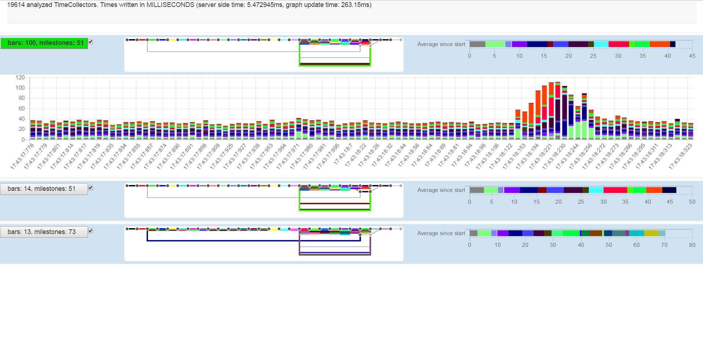

# PathProtector / TimeCollector

Library to set milestones in java code and restrict any java objects to only pass those milestones in a preconfigured order. Monitor how long objects need on their path from milestone to milestone.

With this libary you can 
* define "milestones" anywhere in your code
* define "allowed paths" for your objects
  * in which order milestones have to be passed
  * let exceptions be thrown as soon as a path becomes invalid (to find problems fast)
* let a java object collect the current time at all of those milestones
* connect with your browser to a port to see your objects, their paths and timings in a gui

Here is a screenshot of the browser gui. You can see
* The objects with the TImeCollector activated went 3 different paths through the milestones (blue boxes)
  * The 3 path lengths are 51,51,73 milestones passed
  * An auto generated control flow diagram show the differences between the paths
  * The chart on the right shows the timespan between the milestones, 1 color = 1 edge on the path between two milestones
  * With a click on the button on the left the details open and you see a chart how the timings changed over time

